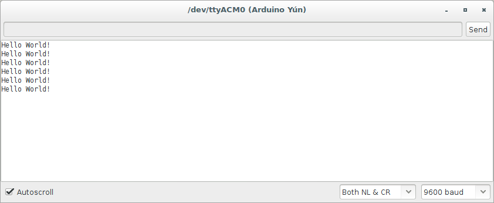

# Resource Pack for MakeMatic Tweeting Plant Exercise

## Equipment Information

## Parts list

|Part|Description|Price (ex VAT)|Supplier|
|----|-----------|--------------|--------|
|Arduino Yun|Main Board| £46.47 | [Cool Components](https://www.coolcomponents.co.uk/arduino-yun.html)|
|Seed Studio Grove Baseshield for Arduino| Interface Shield | £38.38 | [Cool Components](https://www.coolcomponents.co.uk/grove-starter-kit-v3.html)|
|Soil Moisture Sensor| Pre-Wired | £3.52 | [Digi-key](http://www.digikey.co.uk/product-detail/en/101020008/1597-1141-ND/5482619)|
|                    | DI-Wired  | £3.54 | [Cool Components](https://www.coolcomponents.co.uk/soil-moisture-sensor.html)|
|Stackable Headers| Need 2x8 pin | £0.37 | [Cool Components](https://www.coolcomponents.co.uk/stackable-header-8-pin.html)|
|                 |      1x6 pin | £0.36 | [Cool Components](https://www.coolcomponents.co.uk/stackable-header-6-pin.html)|
|                 |      1x10 pin| £0.39 | [Cool Components](https://www.coolcomponents.co.uk/stackable-header-10-pin.html)|

Note, that in the case of the Soil Moisture Sensor, if you use the [Digi-key](http://www.digikey.co.uk/product-detail/en/101020008/1597-1141-ND/5482619) Pre-Wired sensor kit, the instructions for connecting the sensor are slightly different; instead of inserting any pins, the cable for the sensor is inserted in the `A0` slot on the face of the Grove shield. No modification of the code is required.

### Arduino Yun

The [Arduino Yún](https://www.arduino.cc/en/Main/ArduinoBoardYun) is a development board based on the [ATmega32u4](http://www.atmel.com/Images/Atmel-7766-8-bit-AVR-ATmega16U4-32U4_Datasheet.pdf) microcontroller and the [Atheros AR9331](https://www.openhacks.com/uploadsproductos/ar9331_datasheet.pdf) System-on-a-Chip (SOC). The Atheros processor supports a [Linux](https://en.wikipedia.org/wiki/Linux) distribution based on [OpenWrt](https://openwrt.org/) named OpenWrt-Yun. The board has built-in Ethernet and WiFi support, a USB-A port, micro-SD card slot, 20 [digital input/output pins](https://www.arduino.cc/en/Tutorial/DigitalPins) (of which 7 can be used as [PWM](https://www.arduino.cc/en/Tutorial/PWM) outputs and 12 as [analog inputs](https://www.arduino.cc/en/Tutorial/AnalogInputPins)), a 16 MHz crystal oscillator, a micro USB connection, an SPI header, and 3 reset buttons.

### Grove Base Shield

[Grove - Base Shield](http://www.seeedstudio.com/wiki/Grove_-_Base_Shield_V1.3) has a similar shape to Arduino, which enables exact reflections of each I/O pins. Users could easily connect the Base Shield’s I/O ports to Arduino’s I/O ports even without knowing their exact locations. Additionally, each socket includes VCC, GND and two I/O pins, and have names printed on the side. This shield focuses on the simplicity of the interface and convenience of operation, making it even easier to use for newbies. 

## Ideal Pre-Setup steps

1. Installing the Arduino IDE
  * Available on all platforms from [Here](https://www.arduino.cc/en/Main/Software)
1. Extending the Arduino IDE with required libraries
  * We will need two extra pieces of software 
  * Additional Libraries can be installed by clicking `Sketch > Include Library > Manage Libraries` and searching for the desired libraries. 
  * For this Exercise, we will need the "Temboo" library from this list.
  * We will also need the `Grove_LCD_RGB_Backlight` module, which you should [download](https://github.com/Seeed-Studio/Grove_LCD_RGB_Backlight/archive/master.zip) and then install by clicking `Sketch > Include Library > Add .ZIP Library` and selecting the file you just downloaded.
1. Signing up for Temboo API Keys (May be done per-student or single-teacher)
  * Register on [Temboo.com](http://bit.ly/1Q1eHO9)
  * Go to your [Applications](https://temboo.com/account/applications) section, and record the "Key" value, we'll need it later in `finished_tweeting_plant`, where it will be added to `TembooAccount.h`
1. Signing up for Twitter API Keys (It is recommended that this step is done by a single teacher / account holder)
  1.  Go to [dev.twitter.com](https://dev.twitter.com/apps/new) and log in, if necessary
  1. Supply the necessary required fields, and submit the form
  1. Go to the "Keys and Access Tokens" tab and record the Consumer Key and Consumer Secret
  1. Click "Create my access token" and record the Access Token and Access Token Secret.
  * These 4 values will be added to `TembooAccount.h` in the final part of the project.

## Project Resources

### Hello World

[hello_world](Code/hello_world) contains the completed code shown in the video to get the Arduino to say "Hello World" over the [Serial](https://www.arduino.cc/en/Reference/Serial) connection.

When you Verify, Compile and Upload the code, and launch the `Serial Monitor` from the `Tools` dropdown, you should get something like this;

